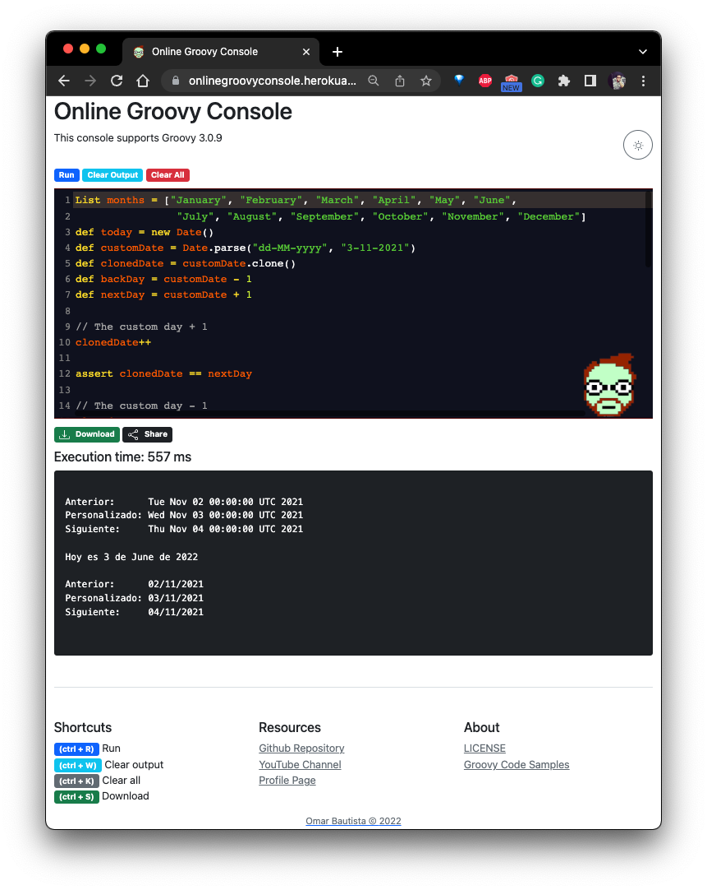

# MicronautGroovyWebConsole

This project is aimed for those people who want to have an online Groovy Console
compatible with Groovy 3.0.6, this project is builtin with Micronaut.

## Technologies

- Groovy 3.0.9
- Micronaut 3.3.0  
- Gradle 7.3.3
- Thymeleaf 2.2.1
- Bootstrap 5

## Preview



## Build project

```shell
./gradlew build
```

## Run project

```shell
java -Dmicronaut.environments=local -jar build/libs/MicronautGroovyWebConsole-1.0-all.jar
```

**Output**
```shell
   ___               _
  |_  |             | |
    | | _____  _____| |__  _   _ ___
    | |/ _ \ \/ / _ \ '_ \| | | / __|
/\__/ / (_) >  <  __/ |_) | |_| \__ \
\____/ \___/_/\_\___|_.__/ \__,_|___/
--------------------------------------------------------------------------
Micronaut Groovy Web Console
https://github.com/Joxebus/MicronautGroovyWebConsole
--------------------------------------------------------------------------
```

There are 3 available profiles `local`, `dropbox` and `heroku`

- `local`: Use a local storage to save files at configured at `application.yml`
- `dropbox`: Use the dropbox configuration to save files also you may need to provide `DROPBOX_TOKEN` 
setting up directly at `application-dropbox.yml` or by env variables.

## Code Samples

You can see some [code samples](https://gist.github.com/Joxebus "Joxebus's Gists") at my gist.

## License

This project is under [Apache 2.0 License](LICENSE "See license here")